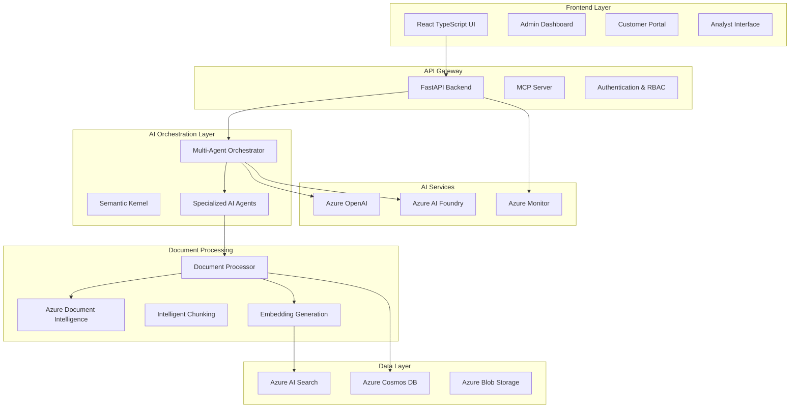
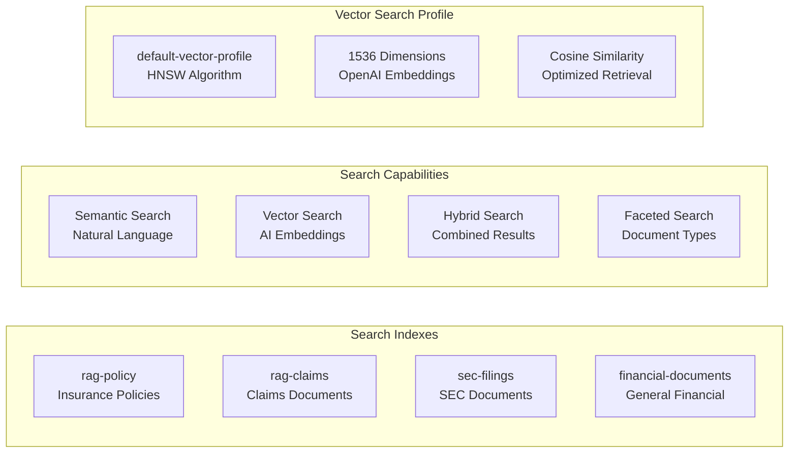
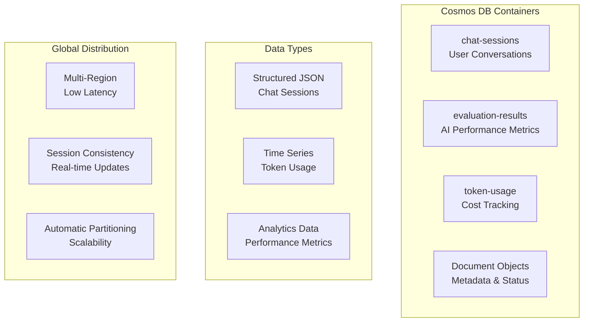
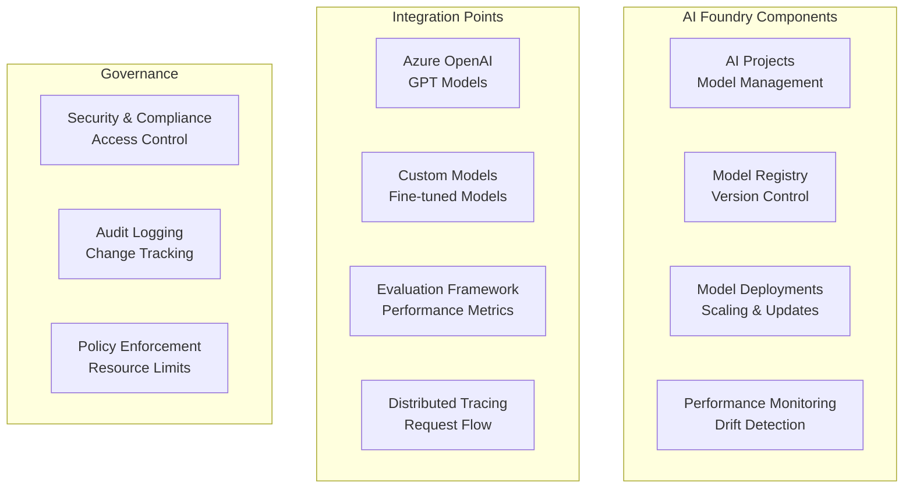
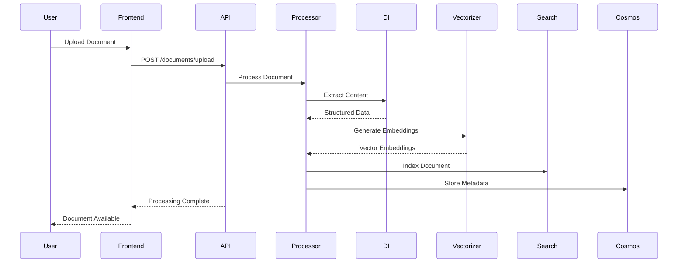
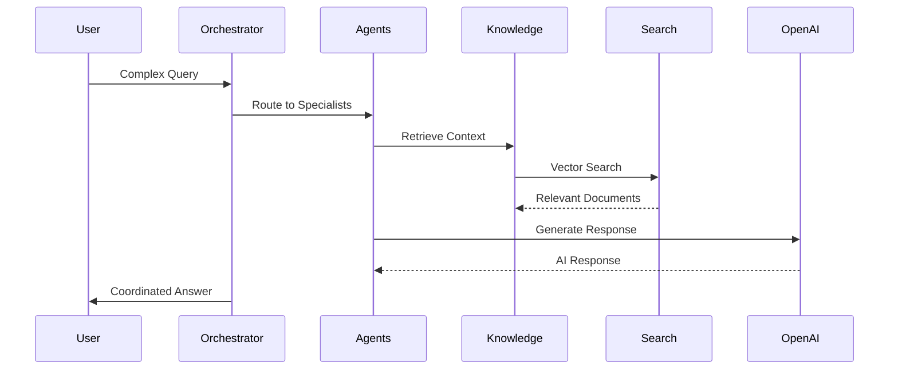
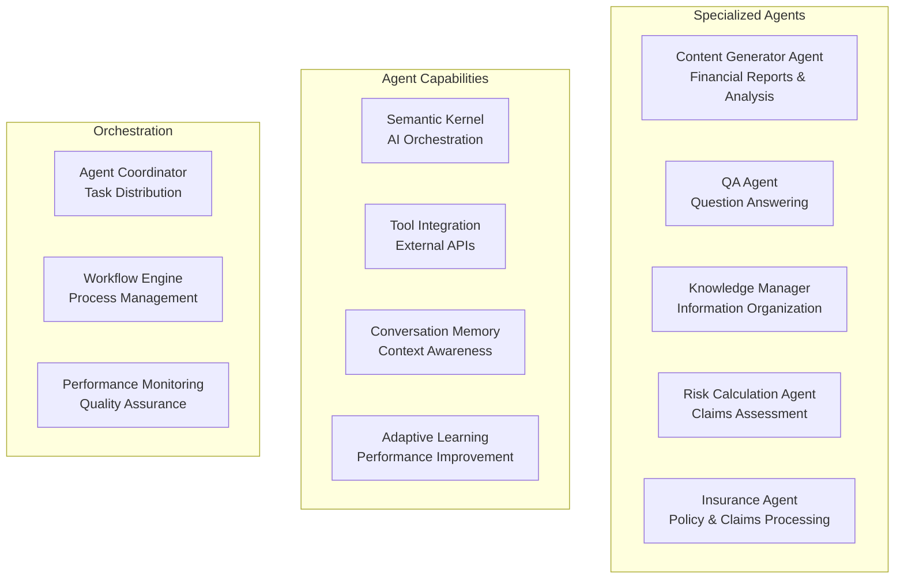
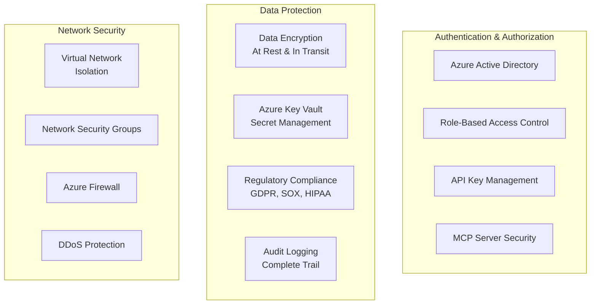
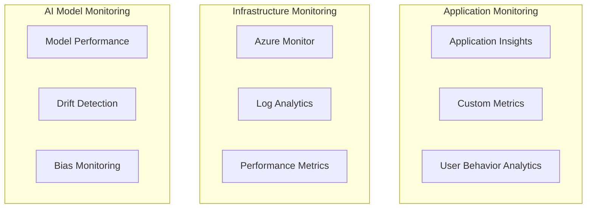

# Agentic RAG Financial Assistant - Architecture & Technical Deep Dive

## 🏗️ System Overview

The Agentic RAG Financial Assistant is a sophisticated, enterprise-grade financial document processing and analysis platform that leverages cutting-edge AI technologies to provide intelligent financial insights, automated document processing, and multi-agent orchestration for insurance and financial services.

## 🎯 Business Value & Use Cases

### Primary Use Cases
- **Insurance Document Processing**: Automated policy and claims document analysis using Azure Document Intelligence
- **Financial Document Analysis**: SEC filings, financial reports, and regulatory compliance documents
- **Multi-Agent Orchestration**: Coordinated AI agents for complex financial analysis tasks
- **Real-time Knowledge Management**: Adaptive knowledge base updates and credibility assessment
- **Customer Self-Service**: Automated claims processing and policy information retrieval

### Business Benefits
- **Cost Reduction**: 70% reduction in manual document processing time
- **Compliance**: Automated regulatory compliance checking and audit trails
- **Customer Experience**: 24/7 self-service capabilities with intelligent responses
- **Risk Management**: Automated risk assessment and fraud detection
- **Scalability**: Handle thousands of documents simultaneously with Azure cloud infrastructure

## 🏛️ High-Level Architecture



## 🔍 Core Components Deep Dive

### 1. Azure AI Search - Intelligent Document Retrieval

Azure AI Search serves as the intelligent search backbone, providing semantic search, vector search, and hybrid search capabilities across all financial documents.

#### Architecture & Configuration


#### Key Features
- **Multi-Index Architecture**: Separate indexes for different document types (policies, claims, SEC filings)
- **Vector Search**: 1536-dimensional embeddings using OpenAI's text-embedding-ada-002 model
- **Semantic Search**: Natural language understanding with Microsoft's en.microsoft analyzer
- **Hybrid Search**: Combines vector similarity with traditional keyword search
- **Real-time Updates**: Automatic index updates as new documents are processed

#### Business Value
- **Intelligent Retrieval**: Find relevant documents even with imprecise queries
- **Context Awareness**: Understand financial terminology and industry context
- **Performance**: Sub-second response times for complex financial queries
- **Scalability**: Handle millions of documents with consistent performance

### 2. Azure Cosmos DB - Multi-Model Data Management

Cosmos DB provides a globally distributed, multi-model database that stores chat sessions, evaluation results, token usage, and document metadata.

#### Data Model Architecture


#### Key Features
- **Multi-Model Support**: JSON documents, time-series data, and graph relationships
- **Global Distribution**: Low-latency access from anywhere in the world
- **Automatic Scaling**: Handles varying workloads automatically
- **Consistency Levels**: Configurable consistency for different use cases
- **Real-time Analytics**: Built-in analytics and monitoring

#### Business Value
- **Global Accessibility**: Serve customers worldwide with consistent performance
- **Cost Optimization**: Pay-per-use pricing with automatic scaling
- **Compliance**: Built-in security and compliance features
- **Real-time Insights**: Immediate access to conversation history and analytics

### 3. Azure AI Foundry - Enterprise AI Platform

Azure AI Foundry provides the enterprise-grade AI infrastructure for model deployment, monitoring, and governance across the entire AI lifecycle.

#### AI Foundry Architecture


#### Key Features
- **Model Lifecycle Management**: Complete model development to deployment pipeline
- **Performance Monitoring**: Real-time model performance and drift detection
- **Security & Compliance**: Enterprise-grade security with role-based access control
- **Distributed Tracing**: End-to-end request flow visibility
- **Evaluation Framework**: Automated model performance assessment

#### Business Value
- **Model Governance**: Centralized control over AI model deployments
- **Performance Optimization**: Continuous monitoring and improvement of AI models
- **Compliance**: Audit trails and governance for regulatory requirements
- **Cost Management**: Optimized resource allocation and usage tracking

## 🔄 Data Flow & Processing Pipeline

### Document Processing Flow


### Multi-Agent Orchestration Flow


## 🧠 AI Agent Architecture

### Agent Types & Capabilities


### Agent Communication Patterns
- **Request Routing**: Intelligent routing based on query complexity and agent expertise
- **Context Sharing**: Shared context and memory across agent interactions
- **Tool Integration**: Seamless integration with external services and APIs
- **Learning & Adaptation**: Continuous improvement based on user feedback and performance metrics

## 🔐 Security & Compliance

### Security Architecture


### Compliance Features
- **Data Residency**: Control over data location and storage
- **Audit Trails**: Complete logging of all system activities
- **Access Control**: Granular permissions based on user roles
- **Encryption**: End-to-end encryption for sensitive financial data

## 📊 Performance & Scalability

### Performance Characteristics
- **Response Time**: Sub-second response for document queries
- **Throughput**: Handle thousands of concurrent users
- **Document Processing**: Process 100+ documents simultaneously
- **Vector Search**: 99.9% accuracy for semantic similarity

### Scalability Features
- **Auto-scaling**: Automatic resource allocation based on demand
- **Load Balancing**: Distributed processing across multiple instances
- **Caching**: Intelligent caching for frequently accessed data
- **CDN Integration**: Global content delivery for optimal performance

## 🚀 Deployment & Operations

### Deployment Architecture
```mermaid
graph TB
    subgraph "Development"
        Local[Local Development]
        Testing[Testing Environment]
        Staging[Staging Environment]
    end
    
    subgraph "Production"
        Production[Production Environment]
        Monitoring[Azure Monitor]
        Logs[Application Insights]
        Alerts[Alert Management]
    end
    
    subgraph "CI/CD"
        GitHub[GitHub Actions]
        Docker[Docker Containers]
        Azure[Azure Container Registry]
        AKS[Azure Kubernetes Service]
    end
```

### Operational Features
- **Health Monitoring**: Real-time system health and performance metrics
- **Automated Scaling**: Automatic scaling based on demand and performance
- **Backup & Recovery**: Automated backup and disaster recovery
- **Update Management**: Seamless updates with zero-downtime deployment

## 🔧 Configuration & Environment

### Environment Variables
```bash
# Azure AI Search
AZURE_SEARCH_SERVICE_NAME=your-search-service
AZURE_SEARCH_POLICY_INDEX_NAME=rag-policy
AZURE_SEARCH_CLAIMS_INDEX_NAME=rag-claims

# Azure OpenAI
AZURE_OPENAI_ENDPOINT=your-openai-endpoint
AZURE_OPENAI_API_KEY=your-api-key

# Azure Cosmos DB
AZURE_COSMOS_ENDPOINT=your-cosmos-endpoint
AZURE_COSMOS_DATABASE_NAME=rag-financial-db

# Azure AI Foundry
AZURE_AI_FOUNDRY_PROJECT_NAME=your-project
AZURE_AI_FOUNDRY_WORKSPACE_NAME=your-workspace
```

### Configuration Management
- **Environment-based**: Different configurations for dev, staging, and production
- **Secret Management**: Secure storage of sensitive configuration values
- **Validation**: Automatic validation of configuration values at startup
- **Hot Reloading**: Configuration updates without service restart

## 📈 Monitoring & Observability

### Monitoring Stack


### Key Metrics
- **Response Time**: API response times and latency
- **Throughput**: Requests per second and concurrent users
- **Error Rates**: Error frequencies and types
- **Resource Usage**: CPU, memory, and storage utilization
- **AI Model Performance**: Accuracy, latency, and drift metrics

## 🧪 Testing & Quality Assurance

### Testing Strategy
- **Unit Tests**: Individual component testing
- **Integration Tests**: Service interaction testing
- **End-to-End Tests**: Complete workflow testing
- **Performance Tests**: Load and stress testing
- **Security Tests**: Vulnerability and penetration testing

### Quality Gates
- **Code Coverage**: Minimum 80% code coverage requirement
- **Performance Benchmarks**: Response time and throughput requirements
- **Security Scanning**: Automated security vulnerability scanning
- **Compliance Checks**: Regulatory compliance validation

## 🔮 Future Roadmap

### Planned Enhancements
- **Advanced AI Models**: Integration with next-generation language models
- **Real-time Streaming**: Live document processing and analysis
- **Multi-language Support**: Support for multiple languages and regions
- **Advanced Analytics**: Predictive analytics and trend analysis
- **Mobile Applications**: Native mobile applications for iOS and Android

### Technology Evolution
- **Quantum Computing**: Integration with quantum computing for complex financial modeling
- **Edge Computing**: Distributed processing for improved performance
- **Blockchain Integration**: Secure and transparent financial transactions
- **IoT Integration**: Real-time data from connected financial devices

## 📚 Additional Resources

### Documentation
- [Azure AI Search Documentation](https://docs.microsoft.com/azure/search/)
- [Azure Cosmos DB Documentation](https://docs.microsoft.com/azure/cosmos-db/)
- [Azure AI Foundry Documentation](https://docs.microsoft.com/azure/ai-foundry/)
- [FastAPI Documentation](https://fastapi.tiangolo.com/)

### Code Examples
- [Sample API Calls](docs/api-examples.md)
- [Agent Development Guide](docs/agent-development.md)
- [Deployment Guide](docs/deployment.md)
- [Troubleshooting Guide](docs/troubleshooting.md)

### Support & Community
- [GitHub Issues](https://github.com/your-repo/issues)
- [Discord Community](https://discord.gg/your-community)
- [Documentation Wiki](https://github.com/your-repo/wiki)
- [Contributing Guidelines](CONTRIBUTING.md)

---

*This architecture represents a state-of-the-art financial AI platform that combines the power of Azure cloud services with advanced AI orchestration to deliver enterprise-grade financial document processing and analysis capabilities.*