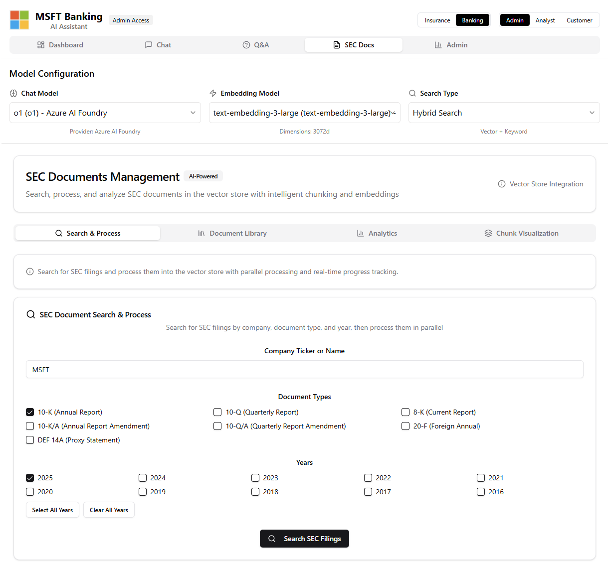
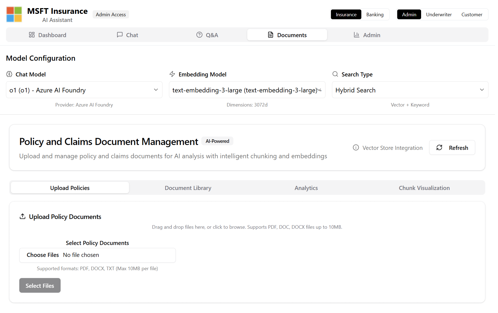

# AI Financial & Insurance Analysis Platform

> **IMPORTANT DISCLAIMER**: This repository is a **work-in-progress demonstration** and is **NOT production-ready**. It serves as an example implementation for educational and development purposes. Do not use in production environments without significant additional development, security review, and testing.

> **ATTRIBUTION**: This project is based on and extends the excellent work from [akshata29/agenticrag](https://github.com/akshata29/agenticrag). We've adapted and enhanced the original architecture to support dual-domain banking and insurance capabilities.

A comprehensive financial and insurance analysis platform that leverages Azure AI services to serve both banking and insurance sectors. The system combines RAG (Retrieval-Augmented Generation), multi-agent orchestration, and advanced document processing to streamline financial analysis, insurance claims processing, and policy management workflows.

## Overview

This repository implements a dual-domain AI platform serving both banking and insurance industries with specialized capabilities:

### Banking Domain
1. **Financial Document Analysis**: Automated processing and analysis of SEC filings, earnings reports, and financial statements
2. **Investment Research**: AI-powered analysis of 10-K/10-Q reports for investment decision support
3. **Regulatory Compliance**: Automated monitoring and analysis of regulatory filings and compliance documents


### Insurance Domain
1. **Intelligent Claims Processing**: Automated ingestion and analysis of claim documents with AI-powered assessment
2. **Policy Document Management**: Comprehensive policy document storage, indexing, and retrieval with semantic search
3. **Multi-Agent Claims Evaluation**: Specialized insurance agents for different claim types (auto, life, health, dental) working collaboratively

## Architecture Overview

```
┌─────────────────────────────────────────────────────────────────────────────────┐
│                        AI Financial & Insurance Analysis Platform               │
└─────────────────────────────────────────────────────────────────────────────────┘

┌────────────────────────────────────────────────────────────────────────────────┐
│                                 CLIENT LAYER                                   │
├─────────────────────┬─────────────────────┬─────────────────────┬──────────────┤
│    Claude Desktop   │   VS Code Extension │   Web Frontend      │   MCP Clients│
│    (MCP Client)     │    (MCP Client)     │   (React + Vite)    │   (Custom)   │
└─────────────────────┴─────────────────────┴─────────────────────┴──────────────┘
                                        │
                                        ▼
┌─────────────────────────────────────────────────────────────────────────────────┐
│                          MODEL CONTEXT PROTOCOL (MCP) SERVER                    │
├─────────────────────────────────────────────────────────────────────────────────┤
│  Banking Tools           │  Insurance Tools        │  Cross-Domain Tools        │
│  • analyze_financial_*   │  • process_claim        │  • coordinate_agents       │
│  • search_database       │  • search_policies      │  • system_statistics       │
│  • extract_metrics       │  • validate_coverage    │                            │
│  • compare_companies     │  • assess_fraud_risk    │                            │
│  • assess_investment     │  • analyze_documents    │                            │
└─────────────────────────────────────────────────────────────────────────────────┘
                                        │
                                        ▼
┌─────────────────────────────────────────────────────────────────────────────────┐
│                              BACKEND API LAYER                                  │
├─────────────────────────────────────────────────────────────────────────────────┤
│                            FastAPI Backend (Python)                             │
│  ┌─────────────────────┐  ┌─────────────────────┐  ┌─────────────────────────┐  │
│  │   Banking Services  │  │  Insurance Services │  │   Shared Services       │  │
│  │  • SEC Document     │  │  • Claims Processing│  │  • Document Processor   │  │
│  │  • Financial Metrics│  │  • Policy Management│  │  • Knowledge Base Mgr   │  │
│  │  • Risk Assessment  │  │  • Fraud Detection  │  │  • Azure AI Services    │  │
│  └─────────────────────┘  └─────────────────────┘  └─────────────────────────┘  │
└─────────────────────────────────────────────────────────────────────────────────┘
                                        │
                                        ▼
┌─────────────────────────────────────────────────────────────────────────────────┐
│                           MULTI-AGENT ORCHESTRATION                             │
├─────────────────────────────────────────────────────────────────────────────────┤
│  ┌─────────────────────┐  ┌─────────────────────┐  ┌─────────────────────────┐  │
│  │   Banking Agents    │  │  Insurance Agents   │  │   Cross-Domain Agents   │  │
│  │  • Financial Analyst│  │  • Claims Assessor  │  │  • Risk Coordinator     │  │
│  │  • Credit Analyst   │  │  • Policy Analyst   │  │  • Data Orchestrator    │  │
│  │  • Compliance Agent │  │  • Fraud Detector   │  │  • Workflow Manager     │  │
│  └─────────────────────┘  └─────────────────────┘  └─────────────────────────┘  │
└─────────────────────────────────────────────────────────────────────────────────┘
                                        │
                                        ▼
┌─────────────────────────────────────────────────────────────────────────────────┐
│                              AZURE AI SERVICES                                  │
├─────────────────────────┬─────────────────────┬─────────────────────────────────┤
│    Azure OpenAI         │   Azure AI Search   │   Document Intelligence         │
│  • GPT-5 for Analysis   │  • Vector Store      │  • PDF/Image Processing        │
│  • Embeddings Models    │  • Semantic Search   │  • Document Recognition        │
│  • Function Calling     │  • Hybrid Search     │  • Layout Analysis             │
└─────────────────────────┴─────────────────────┴─────────────────────────────────┘
                                        │
                                        ▼
┌─────────────────────────────────────────────────────────────────────────────────┐
│                               DATA STORAGE                                      │
├─────────────────────────┬─────────────────────┬─────────────────────────────────┤
│   Financial Documents   │   Insurance Docs    │      Vector Indexes             │
│  • SEC Filings (10-K/Q) │  • Policy Documents │  • financial-documents          │
│  • Earnings Reports     │  • Claims Documents │  • policy-documents             │
│  • Financial Statements │  • Coverage Details │  • claims-documents             │
└─────────────────────────┴─────────────────────┴─────────────────────────────────┘

┌─────────────────────────────────────────────────────────────────────────────────┐
│                            OBSERVABILITY & MONITORING                           │
├─────────────────────────────────────────────────────────────────────────────────┤
│ • Application Insights  • Performance Tracking  • Token Usage  • Error Logging  │
│ • Azure AI Foundry Evaluations  • Multi-Agent Tracing  • Real-time Metrics      │
└─────────────────────────────────────────────────────────────────────────────────┘
```

**Key Architecture Benefits:**
- **Dual-Domain Support**: Native banking and insurance workflows with specialized agents
- **MCP Integration**: Seamless integration with Claude, VS Code, and other MCP clients
- **Scalable Agent System**: Multi-agent orchestration for complex cross-domain scenarios
- **Azure-Native**: Full integration with Azure AI services and enterprise security
- **Flexible Protocols**: Multiple client interfaces (MCP, REST API, WebSocket, SSE)

## Development Status & Disclaimers

### Work-in-Progress Notice
This platform is currently in **active development** and serves as a **proof-of-concept demonstration**. Key limitations include:

- **Security**: Basic authentication only - not suitable for production use
- **Scalability**: Limited load testing and performance optimization
- **Error Handling**: Basic error handling - needs robust production-grade error management
- **Data Privacy**: Additional privacy controls needed for sensitive financial/insurance data
- **Compliance**: Requires additional security audits and compliance verification for regulated industries
- **Testing**: Needs comprehensive test coverage and integration testing

### Intended Use
- **Educational purposes** - Learning AI/ML implementation patterns
- **Development reference** - Architecture and integration examples
- **Prototype development** - Foundation for building production systems
- **Research and experimentation** - Testing AI capabilities in financial/insurance domains

### Production Readiness
Before considering production use, this system would need:
- Security hardening and authentication overhaul
- Comprehensive logging and monitoring
- Performance optimization and load testing
- Regulatory compliance review
- Data encryption and privacy controls
- Professional security audit
- Disaster recovery and backup strategies

## Key Features

### Banking & Financial Analysis



- **SEC Document Processing**: Automated analysis of 10-K, 10-Q, 8-K filings and earnings transcripts
- **Financial Metrics Extraction**: AI-powered extraction of key financial indicators, ratios, and performance data
- **Investment Research**: Comprehensive analysis tools for equity research and investment decision support
- **Regulatory Monitoring**: Automated tracking of regulatory changes and compliance requirements
- **Risk Assessment**: Financial risk analysis and creditworthiness evaluation

### Insurance Claims Processing



- **Multi-Format Support**: PDF, images, and structured claim forms with Azure Document Intelligence
- **Automated Classification**: AI-powered categorization of claims by type, severity, and coverage area
- **Progress Tracking**: Real-time processing status with detailed progress indicators
- **Batch Processing**: Efficient handling of multiple claims documents simultaneously
- **Content Extraction**: Intelligent extraction of key claim details, dates, amounts, and parties involved

### Policy Document Management
- **Policy Indexing**: Semantic indexing of insurance policy documents for fast retrieval
- **Coverage Analysis**: AI-powered analysis of policy coverage and limitations
- **Policy Comparison**: Side-by-side comparison of different policy terms and conditions
- **Expiration Tracking**: Automated monitoring of policy renewal dates and coverage periods

### Multi-Agent Analysis System
- **Banking Specialists**: Financial analysts, credit risk assessors, and regulatory compliance agents
- **Insurance Agents**: Domain-specific agents for auto, life, health, and dental claims
- **Cross-Domain Collaboration**: Multi-agent coordination for complex financial-insurance intersections
- **Risk Evaluation**: AI-powered risk assessment across both banking and insurance domains

### Advanced Observability & Evaluation
- **Claims Processing Metrics**: Real-time monitoring of claims processing performance and accuracy
- **Token Usage Tracking**: Cost monitoring across all Azure OpenAI model usage
- **Evaluation Framework**: Custom metrics for claims assessment quality, accuracy, and compliance
- **Audit Trails**: Comprehensive logging of all claims decisions and processing steps
- **Performance Analytics**: Detailed analytics on processing times, approval rates, and agent performance

### Multi-Agent Claims Orchestration
- **Semantic Kernel Integration**: Coordinated agent workflows for comprehensive claims analysis
- **Insurance Domain Agents**: Specialized agents for Auto, Life, Health, Dental, and General insurance claims
- **Claims Workflow Automation**: End-to-end automated claims processing with human oversight points
- **Agent Collaboration**: Multi-agent collaboration for complex claims requiring multiple expertise areas
- **Parallel Processing**: Multiple agents working simultaneously for faster claims resolution

### Model Context Protocol (MCP) Integration
- **Multiple Protocols**: Support for stdin/stdout, HTTP JSON-RPC, WebSocket, and Server-Sent Events
- **Claude Compatibility**: Native integration with Claude Desktop and other MCP clients
- **Streaming Support**: Real-time progress updates for long-running financial analysis
- **Tool Discovery**: Automatic tool and resource discovery for external AI assistants
- **External Client Support**: Easy integration with VS Code extensions, web apps, and custom clients
- **Enhanced A2A Communication**: Advanced agent-to-agent communication patterns

### Hybrid Search & RAG Pipeline
- **Dual-Index Architecture**: Separate indexes for policy documents and claims documents for optimized search
- **Semantic Search**: Vector-based similarity search for finding relevant policy clauses and similar claims
- **Keyword Search**: Precise text matching for specific policy numbers, claim IDs, and dates
- **Hybrid Search**: Combined semantic and keyword search with intelligent ranking
- **Source Citation**: Automatic citation of policy sections and claim documents supporting decisions
- **Insurance Context**: Domain-specific prompt engineering optimized for insurance terminology and workflows

### Azure AI Foundry Integration
- **Claims Agent Deployment**: Pre-configured insurance claims agents deployed through Azure AI Foundry
- **Insurance Tools Integration**: Native integration with insurance-specific tools and databases
- **Claims Workflow Management**: Automated orchestration of claims processing workflows
- **Agent Specialization**: Customized agent instructions for different insurance domains and claim types
- **Compliance Monitoring**: Built-in compliance checking and regulatory requirement validation

## Architecture

### Backend Services (Python 3.11)
- **FastAPI**: RESTful API for claims processing and policy management
- **Azure AI Search**: Dual-index vector store (policy-documents, claims-documents) with hybrid search
- **Azure OpenAI**: GPT-4 models for claims analysis and policy interpretation
- **Azure Document Intelligence**: Advanced processing of claim forms, policy documents, and supporting materials
- **Azure AI Foundry**: Insurance domain-specific AI agents and model deployment
- **Semantic Kernel**: Claims workflow orchestration and multi-agent coordination
- **Progress Tracking**: Real-time status updates for document processing and claims evaluation

### Frontend Application
- **React + TypeScript**: Modern, responsive interface serving both banking and insurance professionals
- **Vite**: Fast development and production builds
- **Multi-Domain Interface**: Separate optimized views for banking and insurance workflows
- **Role-Based Access**: Specialized interfaces for different user personas in each domain

#### Banking Interface Views
- **Customer Portal**: Investment research tools and financial document access for retail/institutional clients
- **Analyst Dashboard**: Comprehensive financial analysis tools, SEC document research, and investment insights
- **Admin Console**: System administration, user management, and regulatory compliance monitoring

#### Insurance Interface Views  
- **Customer Portal**: Claims submission, policy review, and coverage information for policyholders
- **Underwriter Dashboard**: Claims assessment tools, policy analysis, and risk evaluation interfaces
- **Admin Console**: Claims processing oversight, agent performance monitoring, and system metrics

## Quick Start

### Prerequisites
- Python 3.11+
- Node.js 18+ with npm/yarn/pnpm
- Azure subscription with AI services
- Docker (optional, for containerized deployment)

### 1. Backend Setup
```bash
cd backend
pip install -r requirements.txt
cp .env.example .env
# Configure Azure services in .env file
uvicorn app.main:app --host 0.0.0.0 --port 8000 --reload
```

### 2. Frontend Setup
```bash
cd frontend
npm install
cp .env.example .env
# Configure API endpoints in .env file
npm run dev
```

### 3. Access the Application
- **Frontend**: http://localhost:5173
- **Backend API**: http://localhost:8000
- **API Documentation**: http://localhost:8000/docs
- **Admin Dashboard**: http://localhost:5173 (Admin tab)

## Configuration

### Multi-Domain Document Processing & Routing

The system intelligently routes documents to specialized indexes based on domain and document type:

| Domain | Document Type | Examples | Target Index | Processing Features |
|--------|---------------|----------|--------------|-------------------|
| **Banking** | SEC Filings | 10-K, 10-Q, 8-K reports | `financial-documents` | Financial metrics extraction, trend analysis, regulatory compliance |
| **Banking** | Research Reports | Analyst reports, earnings transcripts | `financial-documents` | Investment insights, market analysis, performance tracking |
| **Insurance** | Policy Documents | Auto, life, health, property policies | `policy-documents` | Coverage analysis, term extraction, renewal tracking |
| **Insurance** | Claims Documents | Claim forms, damage reports, medical records | `claims-documents` | Claim validation, fraud detection, settlement calculation |
| **Insurance** | Supporting Evidence | Photos, receipts, estimates | `claims-documents` | Evidence analysis, damage assessment, cost validation |

### Analysis Depth Levels

The system supports three levels of analysis for both banking and insurance domains:

#### Banking Analysis Levels
| Feature | Quick Analysis | Standard Research | Comprehensive Investigation |
|---------|----------------|------------------|----------------------------|
| **Documents Analyzed** | 3-5 SEC filings | 8-12 financial documents | 15+ comprehensive sources |
| **Analysis Depth** | Key metrics extraction | Full financial analysis | Multi-period trend analysis |
| **Processing Time** | Under 30 seconds | 1-2 minutes | 3-5 minutes |
| **Risk Assessment** | Basic ratios | ✅ Advanced metrics | ✅ Comprehensive modeling |
| **Peer Comparison** | ❌ | ✅ | ✅ |
| **Trend Analysis** | ❌ | ✅ | ✅ |
| **Regulatory Analysis** | ❌ | ❌ | ✅ |
| **Multi-Agent Collaboration** | ❌ | ❌ | ✅ |
| **Use Case** | Quick research | Investment analysis | Due diligence |

#### Insurance Analysis Levels  
| Feature | Quick Assessment | Standard Review | Comprehensive Investigation |
|---------|-----------------|-----------------|---------------------------|
| **Policy Documents Reviewed** | 3-5 | 8-10 | 12-15 |
| **Analysis Depth** | Basic coverage check | Full policy analysis | Complete investigation |
| **Processing Time** | Under 30 seconds | 1-2 minutes | 3-5 minutes |
| **Fraud Detection** | Basic flags | ✅ Advanced | ✅ Comprehensive |
| **Policy Cross-referencing** | ❌ | ✅ | ✅ |
| **Similar Claims Analysis** | ❌ | ✅ | ✅ |
| **Coverage Gap Analysis** | ❌ | ❌ | ✅ |
| **Multi-Agent Collaboration** | ❌ | ❌ | ✅ |
| **Use Case** | Initial triage | Standard claims | Complex/disputed claims |

### Azure Services Setup & Security Requirements

The platform requires multiple Azure services with specific RBAC configurations. Use the provided `azure-deployment-config.json` for automated deployment via Azure CLI, Bicep, or Terraform.

#### Service Principal Requirements

**Primary Service Principal: `sp-ai-financial-insurance-app`**
```bash
# Create service principal
az ad sp create-for-rbac --name "sp-ai-financial-insurance-app" \
  --role "Contributor" \
  --scopes "/subscriptions/{subscription-id}/resourceGroups/rg-ai-financial-insurance"
```

#### Required Azure Services & Roles

##### 1. Azure OpenAI Service
**Service**: `openai-ai-financial-insurance`
- **Models Required**: GPT-5, GPT-4.1, GPT-4.1-mini, text-embedding-3-small, text-embedding-3-large
- **SPN Roles**:
  - `Cognitive Services OpenAI User` - Access to chat completions and embeddings
  - `Cognitive Services OpenAI Contributor` - Model deployment management
- **Managed Identity Roles**:
  - `Cognitive Services OpenAI User` - Runtime access for applications

##### 2. Azure AI Search Service  
**Service**: `search-ai-financial-insurance`
- **Indexes**: financial-documents, policy-documents, claims-documents
- **SPN Roles**:
  - `Search Service Contributor` - Create/manage indexes and skillsets
  - `Search Index Data Contributor` - Read/write search index data
- **Managed Identity Roles**:
  - `Search Index Data Contributor` - Application access to indexes
  - `Search Index Data Reader` - Read-only access for queries
- **AI Foundry/OpenAI Integration**:
  - Grant OpenAI service `Search Index Data Reader` on search service
  - Grant AI Foundry workspace `Search Service Contributor` for index management

##### 3. Cosmos DB Account
**Service**: `cosmos-ai-financial-insurance`
- **Database**: `ai-financial-insurance-db`
- **Containers**: chat-sessions, evaluation-results, token-usage
- **SPN Roles**:
  - `DocumentDB Account Contributor` - Account and database management
  - `Cosmos DB Account Reader` - Read account configuration
- **Managed Identity Roles**:
  - `DocumentDB Account Contributor` - Full access for applications
- **Built-in Cosmos DB Roles**:
  ```bash
  # Custom data plane roles (using Cosmos RBAC)
  az cosmosdb sql role assignment create \
    --account-name cosmos-ai-financial-insurance \
    --resource-group rg-ai-financial-insurance \
    --scope "/" \
    --principal-id {managed-identity-principal-id} \
    --role-definition-id "00000000-0000-0000-0000-000000000002"  # Cosmos DB Built-in Data Contributor
  ```

##### 4. Azure Storage Account
**Service**: `staifinancialinsurance`
- **Containers**: financial-documents, policy-documents, claims-documents, processed-documents, evaluation-data
- **SPN Roles**:
  - `Storage Account Contributor` - Account management
  - `Storage Blob Data Contributor` - Full blob access
- **Managed Identity Roles**:
  - `Storage Blob Data Contributor` - Application access to containers
  - `Storage Queue Data Contributor` - For async processing queues

##### 5. Azure Document Intelligence
**Service**: `doc-intel-ai-financial-insurance`
- **SPN Roles**:
  - `Cognitive Services Contributor` - Service configuration
  - `Cognitive Services User` - Service usage
- **Managed Identity Roles**:
  - `Cognitive Services User` - Application access for document processing

##### 6. Azure Key Vault
**Service**: `kv-ai-financial-insurance`
- **SPN Roles**:
  - `Key Vault Administrator` - Vault management and secret creation
  - `Key Vault Secrets Officer` - Secret management
- **Managed Identity Roles**:
  - `Key Vault Secrets User` - Application access to secrets
- **Application Registration**:
  - Grant application access policy: `Get`, `List` permissions for secrets

##### 7. Azure AI Foundry
**Service**: `ai-financial-insurance-workspace`
- **SPN Roles**:
  - `Azure AI Developer` - Model deployment and evaluation
- **Managed Identity Roles**:
  - `Azure AI Developer` - Application access to AI Foundry services
- **Required Integrations**:
  - **OpenAI Connection**: AI Foundry needs `Cognitive Services OpenAI User` on OpenAI service
  - **Search Connection**: AI Foundry needs `Search Index Data Reader` on Search service
  - **Storage Connection**: AI Foundry needs `Storage Blob Data Reader` on Storage account

##### 8. Application Insights
**Service**: `ai-ai-financial-insurance`
- **SPN Roles**:
  - `Application Insights Component Contributor` - Component management
- **Managed Identity Roles**:
  - `Monitoring Contributor` - Write telemetry and custom metrics

#### 🔗 Cross-Service Permission Matrix

| Source Service | Target Service | Required Role/Permission | Purpose |
|----------------|----------------|-------------------------|---------|
| AI Foundry | Azure OpenAI | `Cognitive Services OpenAI User` | Model access for evaluations |
| AI Foundry | Azure AI Search | `Search Index Data Reader` | Index access for RAG |
| AI Foundry | Azure Storage | `Storage Blob Data Reader` | Document access |
| Azure OpenAI | Azure AI Search | `Search Index Data Reader` | Function calling search integration |
| Application | All Services | Managed Identity roles above | Runtime application access |
| Container Apps | Key Vault | `Key Vault Secrets User` | Secret retrieval |

#### 🚀 Automated Deployment Commands

```bash
# 1. Create resource group
az group create --name rg-ai-financial-insurance --location "East US 2"

# 2. Deploy using the configuration (requires Bicep template)
az deployment group create \
  --resource-group rg-ai-financial-insurance \
  --template-file azure-main.bicep \
  --parameters @azure-deployment-config.json

# 3. Configure role assignments post-deployment
./scripts/configure-rbac.sh
```

#### 🛡️ Security Best Practices
- **Use Managed Identities** for all application authentication
- **Enable Private Endpoints** for all PaaS services
- **Configure Network Security Groups** to restrict access
- **Enable Azure AD authentication** for all services
- **Rotate secrets regularly** in Key Vault
- **Monitor access patterns** via Application Insights and Log Analytics

### Environment Configuration
See detailed configuration in:
- `backend/.env.example` - Backend Azure services and API settings
- `frontend/.env.example` - Frontend configuration and feature flags
- `azure-deployment-config.json` - Complete Azure resource definitions

## API Documentation

The FastAPI backend provides comprehensive API documentation:
- **Interactive Swagger UI**: http://localhost:8000/docs
- **ReDoc Documentation**: http://localhost:8000/redoc
- **OpenAPI Schema**: http://localhost:8000/openapi.json

## Multi-Domain Document Processing

### Supported Document Types

#### Banking & Financial Documents
- **SEC Filings**: 10-K annual reports, 10-Q quarterly reports, 8-K current reports
- **Financial Statements**: Balance sheets, income statements, cash flow statements
- **Analyst Reports**: Equity research reports, investment recommendations, market analysis
- **Earnings Materials**: Earnings transcripts, investor presentations, guidance updates
- **Regulatory Documents**: Proxy statements, regulatory filings, compliance reports

#### Insurance Policy Documents
- **Auto Insurance Policies**: Comprehensive, collision, liability coverage documents
- **Life Insurance Policies**: Term life, whole life, universal life policies
- **Health Insurance Plans**: Medical, dental, vision coverage documents
- **Property Insurance**: Homeowners, renters, commercial property policies
- **Policy Amendments**: Endorsements, riders, and policy modifications

#### Insurance Claims Documents
- **Claim Forms**: ACORD forms, proprietary claim submission forms
- **Supporting Evidence**: Photos, receipts, estimates, invoices
- **Medical Documentation**: Medical reports, bills, treatment records
- **Damage Assessments**: Vehicle damage reports, property inspection reports
- **Investigation Reports**: Claims adjuster reports and investigation findings

#### Administrative Documents
- **Correspondence**: Letters, emails, and communication records across both domains
- **Legal Documents**: Court filings, legal notices, settlement agreements
- **Third-Party Reports**: Credit reports, police reports, accident reports, expert opinions

## Acknowledgments

This project builds upon the excellent foundation provided by [akshata29/agenticrag](https://github.com/akshata29/agenticrag). We extend our gratitude to the original contributors for their innovative work in:

- **Multi-Agent RAG Architecture**: The core orchestration patterns and agent coordination mechanisms
- **Azure AI Integration**: Comprehensive integration with Azure AI services and Document Intelligence
- **FastAPI Backend Structure**: Well-architected API design and service patterns
- **Evaluation Framework**: AI model evaluation and performance monitoring infrastructure

**Key Enhancements in This Fork:**
- Expanded from financial-only to dual-domain (banking + insurance) platform
- Enhanced MCP server with 12 specialized tools for banking and insurance workflows
- Added insurance-specific document processing and claims analysis capabilities
- Implemented cross-domain agent coordination for complex financial-insurance scenarios
- Updated documentation to reflect comprehensive dual-domain functionality

## Support & Documentation

- **Azure AI Foundry**: https://learn.microsoft.com/en-us/azure/ai-foundry/
- **Semantic Kernel**: https://learn.microsoft.com/en-us/semantic-kernel/
- **Azure OpenAI**: https://learn.microsoft.com/en-us/azure/ai-services/openai/
- **FastAPI Documentation**: https://fastapi.tiangolo.com/
- **React Documentation**: https://react.dev/

