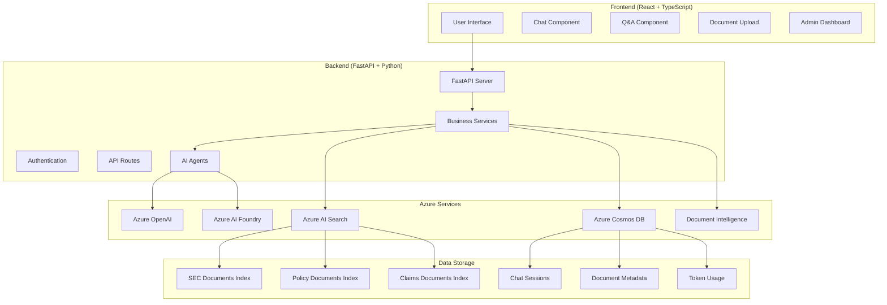
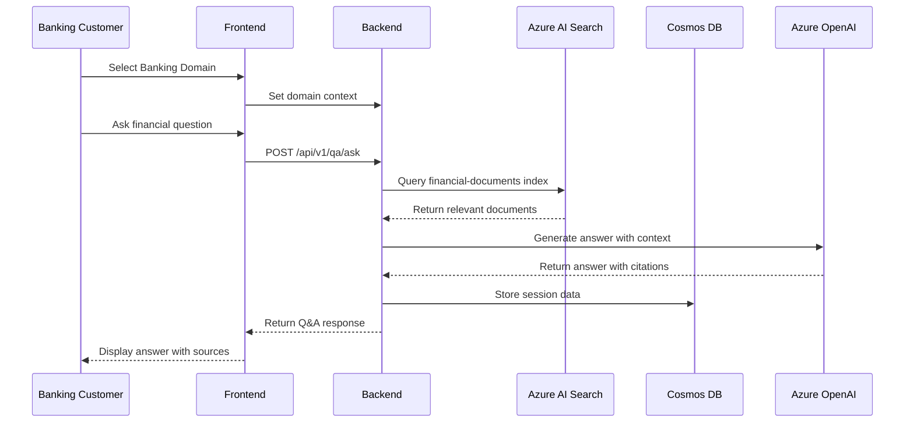
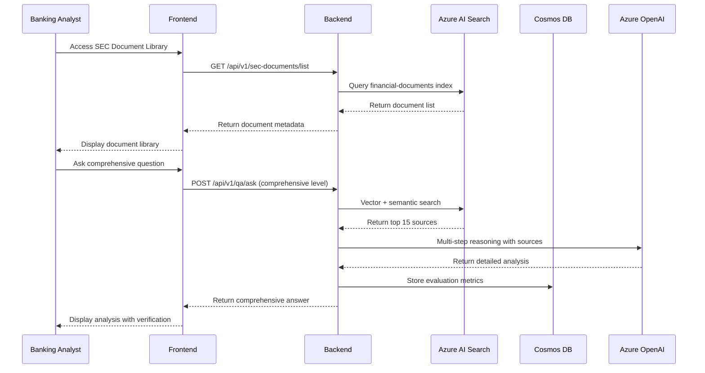
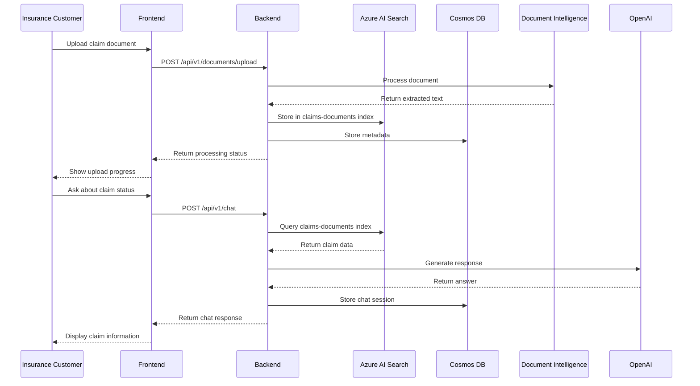
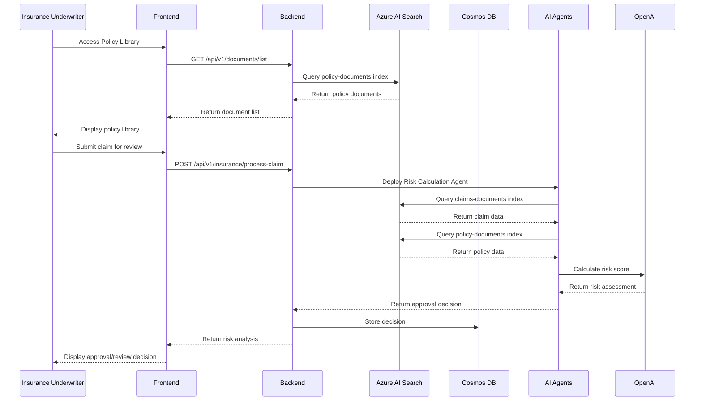
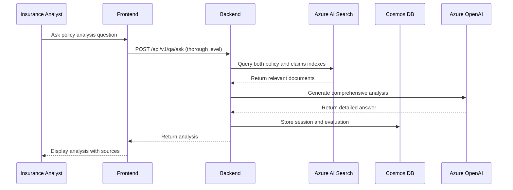
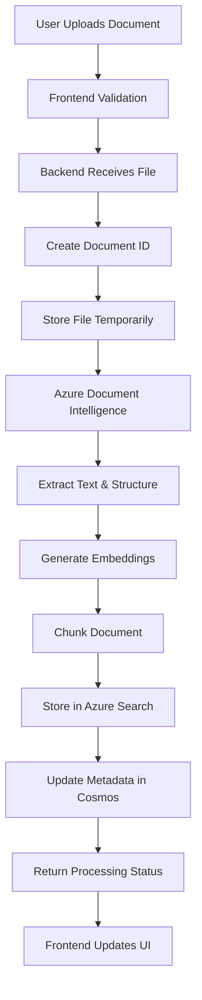
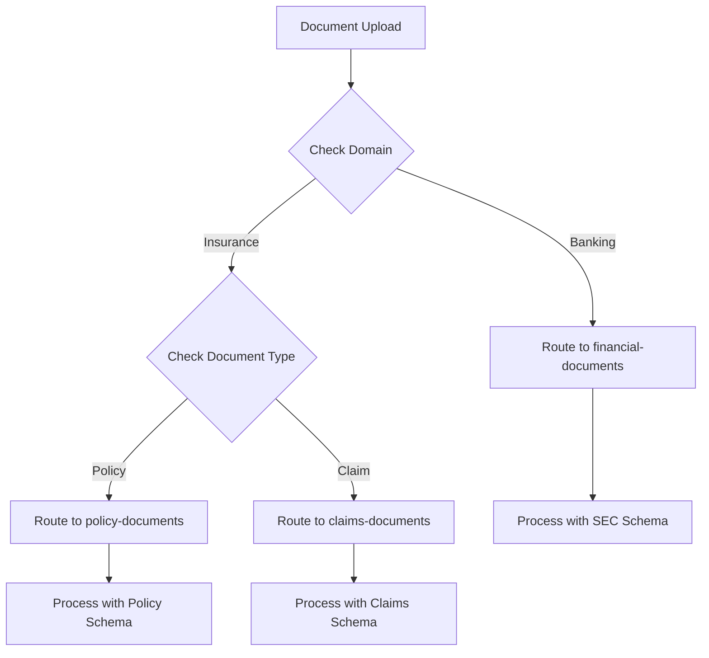
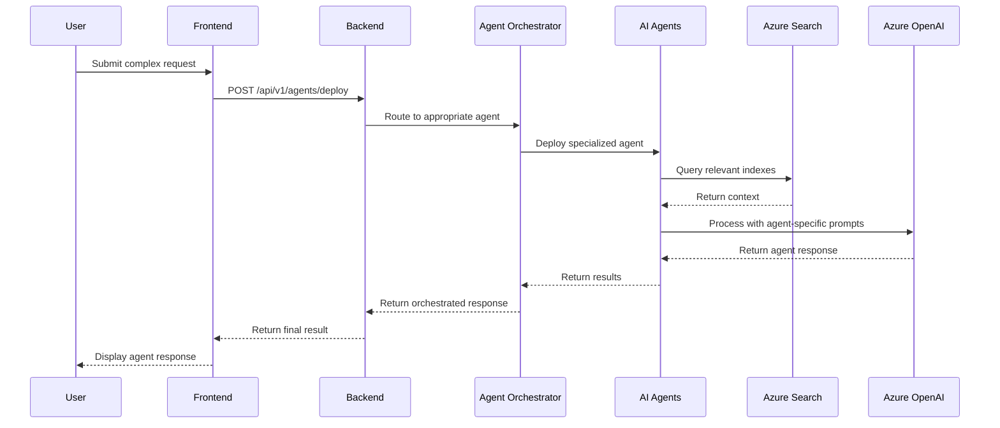

# MSFT Financial AI Assistant - Architecture Documentation

## Overview

The MSFT Financial AI Assistant is a comprehensive RAG (Retrieval-Augmented Generation) application that provides intelligent document processing, analysis, and Q&A capabilities for financial services. The system supports multiple domains (Banking and Insurance) with role-based access control and specialized workflows.

## System Architecture

### High-Level Architecture



## Core Components

### 1. Frontend Application
- **Technology**: React 18 + TypeScript + Vite
- **UI Framework**: Custom components with Tailwind CSS
- **State Management**: React hooks and context
- **Key Features**:
  - Role-based access control (Admin, Underwriter, Analyst, Customer)
  - Domain switching (Banking/Insurance)
  - Real-time chat interface
  - Document upload with progress tracking
  - Interactive Q&A with verification levels
  - Admin dashboard with observability

### 2. Backend Services
- **Framework**: FastAPI with async/await
- **Authentication**: Azure AD integration
- **Observability**: Custom telemetry and logging
- **Key Services**:
  - Document processing pipeline
  - Multi-agent orchestration
  - RAG query processing
  - Session management
  - Token usage tracking

### 3. Azure AI Services Integration
- **Azure OpenAI**: GPT-4 models for chat and Q&A
- **Azure AI Search**: Vector search with semantic ranking
- **Azure Cosmos DB**: Session storage and metadata
- **Azure Document Intelligence**: Document processing
- **Azure AI Foundry**: Agent deployment and management

## Data Architecture

### Azure AI Search Indexes

The system uses three specialized indexes for different document types:

#### 1. Financial Documents Index (`financial-documents`)
**Purpose**: SEC filings and banking documents
**Schema**:
```json
{
  "id": "string (key)",
  "content": "searchable text",
  "content_vector": "vector(1536)",
  "document_title": "searchable",
  "document_type": "filterable",
  "section_title": "searchable",
  "page_number": "int32",
  "chunk_id": "string",
  "metadata": "string",
  "created_date": "datetime"
}
```

#### 2. Policy Documents Index (`policy-documents`)
**Purpose**: Insurance policy documents
**Schema**:
```json
{
  "id": "string (key)",
  "content": "searchable text",
  "content_vector": "vector(1536)",
  "title": "searchable",
  "document_id": "string",
  "source": "string",
  "chunk_id": "string",
  "parent_id": "string",
  "section_type": "string",
  "page_number": "int32",
  "processed_at": "string",
  "citation_info": "string",
  "policy_number": "string",
  "insured_name": "string",
  "line_of_business": "string",
  "state": "string",
  "effective_date": "string",
  "expiration_date": "string",
  "deductible": "string",
  "coverage_limits": "string",
  "exclusions": "string",
  "endorsements": "string"
}
```

#### 3. Claims Documents Index (`claims-documents`)
**Purpose**: Insurance claim documents
**Schema**:
```json
{
  "id": "string (key)",
  "content": "searchable text",
  "content_vector": "vector(1536)",
  "title": "searchable",
  "document_id": "string",
  "source": "string",
  "chunk_id": "string",
  "parent_id": "string",
  "section_type": "string",
  "page_number": "int32",
  "processed_at": "string",
  "claim_id": "string",
  "policy_number": "string",
  "insured_name": "string",
  "date_of_loss": "string",
  "loss_cause": "string",
  "location": "string",
  "coverage_decision": "string",
  "settlement_summary": "string",
  "payout_amount": "double"
}
```

### Azure Cosmos DB Collections

#### 1. Chat Sessions (`chat-sessions`)
**Purpose**: Store conversation history and context
**Partition Key**: `/session_id`
**Schema**:
```json
{
  "id": "session_id",
  "session_id": "string",
  "user_id": "string",
  "created_at": "datetime",
  "updated_at": "datetime",
  "messages": [
    {
      "role": "user|assistant",
      "content": "string",
      "timestamp": "datetime",
      "citations": "array"
    }
  ],
  "total_tokens": "number",
  "domain": "banking|insurance"
}
```

#### 2. Document Metadata (`document-metadata`)
**Purpose**: Store document processing metadata
**Partition Key**: `/document_id`
**Schema**:
```json
{
  "id": "document_id",
  "document_id": "string",
  "filename": "string",
  "document_type": "string",
  "company_name": "string",
  "filing_date": "datetime",
  "file_size": "number",
  "processing_stats": {
    "total_chunks": "number",
    "processing_time": "number",
    "embedding_tokens": "number"
  },
  "index_name": "string",
  "created_at": "datetime"
}
```

#### 3. Token Usage (`token-usage`)
**Purpose**: Track API usage and costs
**Partition Key**: `/record_id`
**Schema**:
```json
{
  "id": "record_id",
  "record_id": "string",
  "session_id": "string",
  "user_id": "string",
  "service_type": "chat|qa|document_processing",
  "operation_type": "string",
  "model_name": "string",
  "prompt_tokens": "number",
  "completion_tokens": "number",
  "total_tokens": "number",
  "timestamp": "datetime",
  "success": "boolean",
  "http_status_code": "number"
}
```

#### 4. Evaluation Results (`evaluation-results`)
**Purpose**: Store Q&A evaluation metrics
**Partition Key**: `/session_id`
**Schema**:
```json
{
  "id": "evaluation_id",
  "session_id": "string",
  "question_id": "string",
  "evaluator_type": "custom|foundry",
  "rag_method": "string",
  "evaluation_timestamp": "datetime",
  "accuracy_score": "number",
  "completeness_score": "number",
  "relevance_score": "number",
  "overall_score": "number",
  "feedback": "string"
}
```

## User Personas and Workflows

### 1. Banking Domain

#### Banking Customer
**Access**: Chat, Q&A, SEC Document Library
**Workflow**:


#### Banking Analyst
**Access**: Chat, Q&A, SEC Document Library, Admin Dashboard
**Workflow**:


### 2. Insurance Domain

#### Insurance Customer
**Access**: Chat, Q&A, Submit Claims, My Claims
**Workflow**:


#### Insurance Underwriter
**Access**: Chat, Q&A, Policy Library, Claims Review, Admin Dashboard
**Workflow**:


#### Insurance Analyst
**Access**: Chat, Q&A, Policy Library, Claims Review
**Workflow**:


## Document Processing Pipeline

### Upload Flow


### Index Routing Logic


## Q&A Verification Levels

### 1. Basic Verification
- **Source Documents**: 5
- **Content Length**: 800 characters
- **Response Time**: Fastest
- **Features**: Quick answers with essential citations

### 2. Thorough Verification
- **Source Documents**: 10
- **Content Length**: 1200 characters
- **Response Time**: Standard
- **Features**: Comprehensive analysis with source verification and conflict identification

### 3. Comprehensive Verification
- **Source Documents**: 15
- **Content Length**: 1600 characters
- **Response Time**: Thorough
- **Features**: Exhaustive analysis with question decomposition, multi-angle investigation, and detailed limitation analysis

## Multi-Agent Orchestration

### Agent Types
1. **Chat Content Agent**: General conversation and assistance
2. **Financial QA Agent**: Domain-specific question answering
3. **Risk Calculation Agent**: Insurance claim risk assessment
4. **Content Generator Agent**: Document generation and summarization

### Agent Workflow


## Security and Access Control

### Role-Based Access
- **Admin**: Full system access, configuration, monitoring
- **Underwriter**: Policy management, claims review, analytics
- **Analyst**: Data analysis, reporting, limited admin access
- **Customer**: Chat, Q&A, document upload (domain-specific)

### Domain Isolation
- **Banking**: SEC documents, financial analysis tools
- **Insurance**: Policy documents, claims processing, risk assessment

## Observability and Monitoring

### Metrics Tracked
- Request/response times
- Token usage and costs
- Document processing statistics
- Agent performance metrics
- User interaction patterns
- Error rates and types

### Storage Locations
- **Application Insights**: Real-time metrics and traces
- **Cosmos DB**: Historical data and session information
- **Azure Log Analytics**: System logs and performance data

## Performance Characteristics

### Response Times
- **Basic Q&A**: 2-5 seconds
- **Thorough Q&A**: 5-10 seconds
- **Comprehensive Q&A**: 10-20 seconds
- **Document Upload**: 30-60 seconds (depending on size)
- **Chat Response**: 1-3 seconds

### Scalability
- **Concurrent Users**: 100+ simultaneous users
- **Document Processing**: 50+ documents per hour
- **Search Queries**: 1000+ queries per minute
- **Storage**: Petabyte-scale document storage

## Deployment Architecture

### Azure Resources
- **App Service**: Frontend hosting
- **Container Instances**: Backend API hosting
- **Azure AI Search**: Document indexing and search
- **Cosmos DB**: Session and metadata storage
- **Azure OpenAI**: Language model services
- **Document Intelligence**: Document processing
- **AI Foundry**: Agent management
- **Application Insights**: Monitoring and observability

### Environment Configuration
- **Development**: Local development with Azure services
- **Staging**: Pre-production testing environment
- **Production**: Full-scale deployment with high availability

This architecture provides a robust, scalable foundation for financial document processing and AI-powered analysis across multiple domains and user personas.
