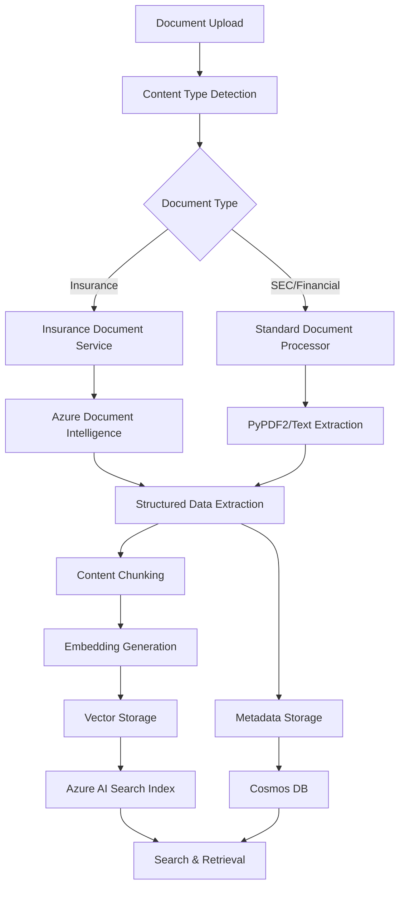
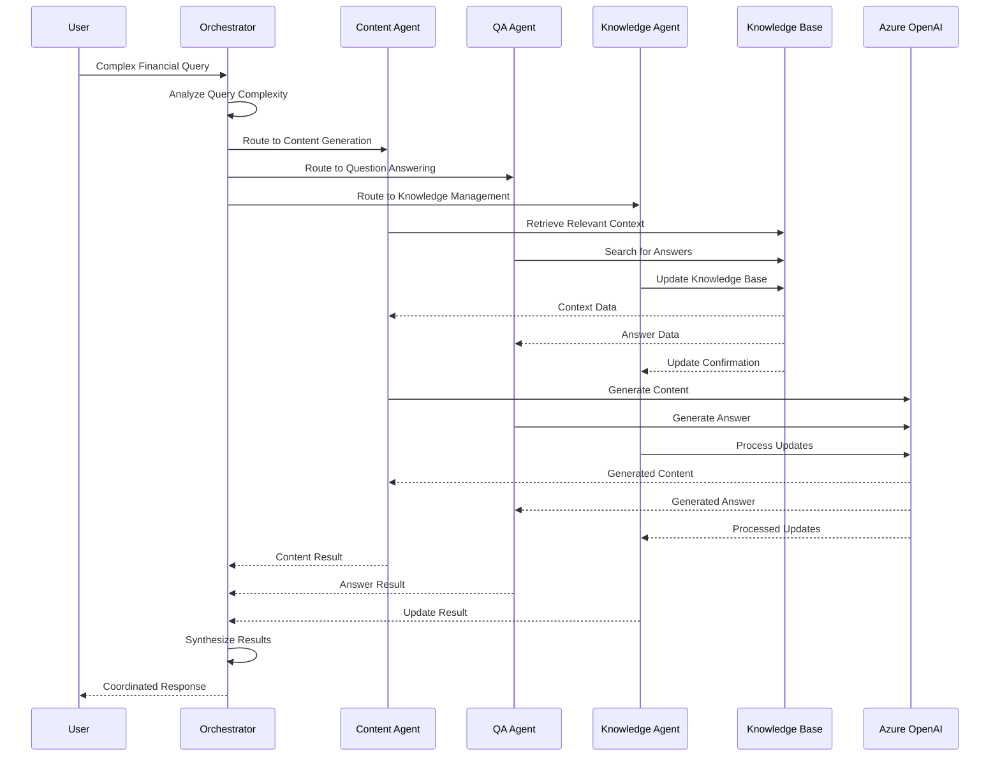

# Technical Architecture Deep Dive

## 🔧 System Components & Implementation

### Backend Architecture (FastAPI)

The backend is built using FastAPI with a modular architecture that separates concerns and enables easy scaling:

```python
# Main application structure
app/
├── api/                    # REST API endpoints
│   ├── routes/            # Route handlers
│   │   ├── documents.py   # Document upload/processing
│   │   ├── chat.py        # Chat interactions
│   │   ├── qa.py          # Q&A functionality
│   │   └── admin.py       # Administrative functions
├── core/                   # Core configuration & utilities
│   ├── config.py          # Environment configuration
│   ├── observability.py   # Monitoring & tracing
│   └── tracing.py         # AI Foundry integration
├── services/               # Business logic services
│   ├── agents/            # AI agent implementations
│   ├── azure_services.py  # Azure service management
│   └── knowledge_base_manager.py  # Knowledge management
└── models/                 # Data models & schemas
    ├── schemas.py         # Pydantic models
    └── evaluation.py      # Evaluation data models
```

### Frontend Architecture (React + TypeScript)

The frontend uses a modern React architecture with TypeScript for type safety:

```typescript
// Component structure
src/
├── components/             # Reusable UI components
│   ├── chat/              # Chat interface components
│   ├── admin/             # Administrative dashboard
│   ├── customer/          # Customer portal components
│   └── shared/            # Common UI elements
├── contexts/               # React context providers
│   └── ThemeContext.tsx   # Theme management
├── hooks/                  # Custom React hooks
├── services/               # API service layer
└── lib/                    # Utility functions
```

## 🗄️ Data Flow Architecture

### Document Processing Pipeline



### Multi-Agent Communication Flow



## 🔐 Security Implementation

### Authentication & Authorization

```python
# Role-based access control implementation
class UserRole(Enum):
    CUSTOMER = "customer"
    ANALYST = "analyst"
    UNDERWRITER = "underwriter"
    ADMIN = "admin"

class Domain(Enum):
    INSURANCE = "insurance"
    BANKING = "banking"
    SECURITIES = "securities"

# Permission matrix
PERMISSIONS = {
    UserRole.CUSTOMER: {
        Domain.INSURANCE: ["read_policies", "submit_claims"],
        Domain.BANKING: ["view_accounts", "make_transfers"]
    },
    UserRole.ANALYST: {
        Domain.INSURANCE: ["read_all", "analyze_claims"],
        Domain.BANKING: ["read_all", "analyze_transactions"]
    },
    UserRole.ADMIN: {
        "*": ["*"]  # Full access to all domains
    }
}
```

### Data Encryption

```python
# Encryption at rest and in transit
from cryptography.fernet import Fernet
from azure.keyvault.keys import KeyClient
from azure.keyvault.keys.crypto import CryptographyClient

class DataEncryption:
    def __init__(self, key_vault_url: str):
        self.key_client = KeyClient(vault_url=key_vault_url)
        self.crypto_client = CryptographyClient(
            key=self.key_client.get_key("encryption-key")
        )
    
    def encrypt_sensitive_data(self, data: str) -> bytes:
        """Encrypt sensitive financial data"""
        return self.crypto_client.encrypt(
            algorithm="RSA-OAEP",
            plaintext=data.encode()
        )
    
    def decrypt_sensitive_data(self, encrypted_data: bytes) -> str:
        """Decrypt sensitive financial data"""
        result = self.crypto_client.decrypt(
            algorithm="RSA-OAEP",
            ciphertext=encrypted_data
        )
        return result.plaintext.decode()
```

## 📊 Performance Optimization

### Caching Strategy

```python
# Multi-layer caching implementation
from functools import lru_cache
import redis
from azure.search.documents import SearchClient

class CachingStrategy:
    def __init__(self):
        self.redis_client = redis.Redis(host='localhost', port=6379, db=0)
        self.memory_cache = {}
    
    @lru_cache(maxsize=1000)
    def get_cached_document(self, doc_id: str) -> Dict:
        """Memory cache for frequently accessed documents"""
        return self.memory_cache.get(doc_id)
    
    async def get_redis_cached_document(self, doc_id: str) -> Dict:
        """Redis cache for document metadata"""
        cached = self.redis_client.get(f"doc:{doc_id}")
        if cached:
            return json.loads(cached)
        return None
    
    async def cache_search_results(self, query: str, results: List[Dict]):
        """Cache search results for common queries"""
        cache_key = f"search:{hash(query)}"
        self.redis_client.setex(
            cache_key, 
            3600,  # 1 hour TTL
            json.dumps(results)
        )
```

### Database Optimization

```python
# Cosmos DB optimization strategies
class CosmosDBOptimizer:
    def __init__(self, cosmos_client):
        self.client = cosmos_client
        self.database = self.client.get_database_client("rag-financial-db")
    
    async def optimize_container_performance(self, container_name: str):
        """Optimize container for specific workload"""
        container = self.database.get_container_client(container_name)
        
        # Configure indexing policy for optimal performance
        indexing_policy = {
            "indexingMode": "consistent",
            "automatic": True,
            "includedPaths": [
                {
                    "path": "/content/?",
                    "indexes": [
                        {"kind": "Range", "dataType": "String"},
                        {"kind": "Range", "dataType": "Number"}
                    ]
                },
                {
                    "path": "/metadata/*",
                    "indexes": [
                        {"kind": "Range", "dataType": "String"},
                        {"kind": "Hash", "dataType": "String"}
                    ]
                }
            ],
            "excludedPaths": [
                {"path": "/content_vector/*"}  # Exclude vector data from indexing
            ]
        }
        
        await container.replace_indexing_policy(indexing_policy)
    
    async def create_partitioned_container(self, container_name: str, partition_key: str):
        """Create container with optimal partitioning"""
        container_properties = {
            "id": container_name,
            "partitionKey": {
                "paths": [f"/{partition_key}"],
                "kind": "Hash"
            },
            "indexingPolicy": self._get_optimized_indexing_policy()
        }
        
        return await self.database.create_container(container_properties)
```

## 🔍 Search & Retrieval Optimization

### Vector Search Configuration

```python
# Azure AI Search vector search optimization
class VectorSearchOptimizer:
    def __init__(self, search_client: SearchClient):
        self.client = search_client
    
    def create_optimized_index(self, index_name: str):
        """Create index with optimized vector search configuration"""
        index_definition = {
            "name": index_name,
            "fields": [
                {
                    "name": "id",
                    "type": "Edm.String",
                    "key": True,
                    "searchable": False
                },
                {
                    "name": "content",
                    "type": "Edm.String",
                    "searchable": True,
                    "analyzer": "en.microsoft",
                    "searchable": True
                },
                {
                    "name": "content_vector",
                    "type": "Collection(Edm.Single)",
                    "searchable": True,
                    "dimensions": 1536,
                    "vectorSearchProfile": "default-vector-profile"
                }
            ],
            "vectorSearch": {
                "algorithms": [
                    {
                        "name": "default-vector-profile",
                        "kind": "hnsw",
                        "parameters": {
                            "m": 4,
                            "efConstruction": 400,
                            "efSearch": 500,
                            "metric": "cosine"
                        }
                    }
                ],
                "profiles": [
                    {
                        "name": "default-vector-profile",
                        "algorithm": "default-vector-profile"
                    }
                ]
            }
        }
        
        return self.client.create_index(index_definition)
    
    def optimize_search_queries(self, query: str, filters: Dict = None):
        """Optimize search queries for performance"""
        search_options = {
            "queryType": "semantic",
            "semanticConfiguration": "default",
            "queryLanguage": "en-us",
            "vectorQueries": [
                {
                    "vector": self._generate_query_embedding(query),
                    "fields": "content_vector",
                    "k": 10
                }
            ],
            "select": "id,content,document_title,metadata",
            "top": 20
        }
        
        if filters:
            search_options["filter"] = self._build_filter_string(filters)
        
        return search_options
```

## 🚀 Deployment & Scaling

### Container Orchestration

```yaml
# Docker Compose configuration for development
version: '3.8'
services:
  backend:
    build: ./backend
    ports:
      - "8000:8000"
    environment:
      - AZURE_SEARCH_SERVICE_NAME=${AZURE_SEARCH_SERVICE_NAME}
      - AZURE_OPENAI_ENDPOINT=${AZURE_OPENAI_ENDPOINT}
    volumes:
      - ./backend:/app
    depends_on:
      - redis
      - cosmosdb
  
  frontend:
    build: ./frontend
    ports:
      - "3000:3000"
    volumes:
      - ./frontend:/app
    depends_on:
      - backend
  
  redis:
    image: redis:alpine
    ports:
      - "6379:6379"
  
  cosmosdb:
    image: mcr.microsoft.com/cosmosdb/linux/azure-cosmos-emulator
    ports:
      - "8081:8081"
    environment:
      - AZURE_COSMOS_EMULATOR_PARTITION_COUNT=10
```

### Kubernetes Deployment

```yaml
# Kubernetes deployment configuration
apiVersion: apps/v1
kind: Deployment
metadata:
  name: agentic-rag-backend
spec:
  replicas: 3
  selector:
    matchLabels:
      app: agentic-rag-backend
  template:
    metadata:
      labels:
        app: agentic-rag-backend
    spec:
      containers:
      - name: backend
        image: agentic-rag-backend:latest
        ports:
        - containerPort: 8000
        env:
        - name: AZURE_SEARCH_SERVICE_NAME
          valueFrom:
            secretKeyRef:
              name: azure-secrets
              key: search-service-name
        resources:
          requests:
            memory: "512Mi"
            cpu: "250m"
          limits:
            memory: "1Gi"
            cpu: "500m"
        livenessProbe:
          httpGet:
            path: /health
            port: 8000
          initialDelaySeconds: 30
          periodSeconds: 10
        readinessProbe:
          httpGet:
            path: /ready
            port: 8000
          initialDelaySeconds: 5
          periodSeconds: 5
```

## 📈 Monitoring & Observability

### Application Performance Monitoring

```python
# OpenTelemetry integration for observability
from opentelemetry import trace, metrics
from opentelemetry.exporter.azure_monitor import AzureMonitorTraceExporter
from opentelemetry.sdk.trace import TracerProvider
from opentelemetry.sdk.trace.export import BatchSpanProcessor

class ObservabilityManager:
    def __init__(self, connection_string: str):
        self.connection_string = connection_string
        self._setup_tracing()
        self._setup_metrics()
    
    def _setup_tracing(self):
        """Setup distributed tracing with Azure Monitor"""
        trace.set_tracer_provider(TracerProvider())
        tracer = trace.get_tracer(__name__)
        
        azure_exporter = AzureMonitorTraceExporter(
            connection_string=self.connection_string
        )
        
        span_processor = BatchSpanProcessor(azure_exporter)
        trace.get_tracer_provider().add_span_processor(span_processor)
        
        return tracer
    
    def track_document_processing(self, document_id: str, processing_time: float):
        """Track document processing performance"""
        tracer = trace.get_tracer(__name__)
        
        with tracer.start_as_current_span("document_processing") as span:
            span.set_attribute("document.id", document_id)
            span.set_attribute("processing.time", processing_time)
            span.set_attribute("processing.status", "completed")
    
    def track_search_performance(self, query: str, response_time: float, result_count: int):
        """Track search query performance"""
        tracer = trace.get_tracer(__name__)
        
        with tracer.start_as_current_span("search_query") as span:
            span.set_attribute("query.text", query)
            span.set_attribute("response.time", response_time)
            span.set_attribute("result.count", result_count)
```

### Health Checks & Diagnostics

```python
# Comprehensive health check implementation
from fastapi import FastAPI
from fastapi.health import health_check
import psutil
import asyncio

class HealthChecker:
    def __init__(self, app: FastAPI):
        self.app = app
        self._setup_health_checks()
    
    def _setup_health_checks(self):
        """Setup comprehensive health checks"""
        @self.app.get("/health")
        async def health_check():
            return {
                "status": "healthy",
                "timestamp": datetime.utcnow().isoformat(),
                "services": await self._check_services(),
                "system": self._check_system_health()
            }
        
        @self.app.get("/ready")
        async def readiness_check():
            return {
                "status": "ready",
                "dependencies": await self._check_dependencies()
            }
    
    async def _check_services(self) -> Dict:
        """Check health of all dependent services"""
        services = {}
        
        # Check Azure AI Search
        try:
            search_client = self._get_search_client()
            await search_client.get_document_count()
            services["azure_search"] = "healthy"
        except Exception as e:
            services["azure_search"] = f"unhealthy: {str(e)}"
        
        # Check Cosmos DB
        try:
            cosmos_client = self._get_cosmos_client()
            await cosmos_client.get_database_client("rag-financial-db").read()
            services["cosmos_db"] = "healthy"
        except Exception as e:
            services["cosmos_db"] = f"unhealthy: {str(e)}"
        
        # Check Azure OpenAI
        try:
            openai_client = self._get_openai_client()
            await openai_client.chat.completions.create(
                model="gpt-4o-mini",
                messages=[{"role": "user", "content": "test"}],
                max_tokens=5
            )
            services["azure_openai"] = "healthy"
        except Exception as e:
            services["azure_openai"] = f"unhealthy: {str(e)}"
        
        return services
    
    def _check_system_health(self) -> Dict:
        """Check system resource health"""
        return {
            "cpu_percent": psutil.cpu_percent(interval=1),
            "memory_percent": psutil.virtual_memory().percent,
            "disk_percent": psutil.disk_usage('/').percent,
            "network_connections": len(psutil.net_connections())
        }
```

## 🔧 Configuration Management

### Environment Configuration

```python
# Comprehensive configuration management
from pydantic_settings import BaseSettings
from typing import Optional, List
import os

class Settings(BaseSettings):
    # Azure AI Search Configuration
    AZURE_SEARCH_SERVICE_NAME: str
    AZURE_SEARCH_POLICY_INDEX_NAME: str = "rag-policy"
    AZURE_SEARCH_CLAIMS_INDEX_NAME: str = "rag-claims"
    AZURE_SEARCH_SEC_INDEX_NAME: str = "sec-filings"
    
    # Azure OpenAI Configuration
    AZURE_OPENAI_ENDPOINT: str
    AZURE_OPENAI_API_KEY: str
    AZURE_OPENAI_CHAT_DEPLOYMENT_NAME: str = "chat4omini"
    AZURE_OPENAI_EMBEDDING_DEPLOYMENT_NAME: str = "text-embedding-ada-002"
    
    # Azure Cosmos DB Configuration
    AZURE_COSMOS_ENDPOINT: str
    AZURE_COSMOS_DATABASE_NAME: str = "rag-financial-db"
    AZURE_COSMOS_CONTAINER_NAME: str = "chat-sessions"
    
    # Azure AI Foundry Configuration
    AZURE_AI_FOUNDRY_PROJECT_NAME: str
    AZURE_AI_FOUNDRY_WORKSPACE_NAME: str
    AZURE_AI_FOUNDRY_RESOURCE_GROUP: str
    
    # Performance Configuration
    MAX_DOCUMENT_SIZE_MB: int = 50
    CHUNK_SIZE: int = 1000
    CHUNK_OVERLAP: int = 200
    MAX_CONCURRENT_PROCESSING: int = 10
    
    # Security Configuration
    ENABLE_TELEMETRY: bool = False
    LOG_LEVEL: str = "INFO"
    
    class Config:
        env_file = ".env"
        case_sensitive = False

# Global settings instance
settings = Settings()
```

This technical architecture document provides the implementation details and code examples that complement the high-level architecture overview in the main README. It covers the technical implementation aspects, performance optimizations, security measures, and operational considerations for the Agentic RAG Financial Assistant platform.
